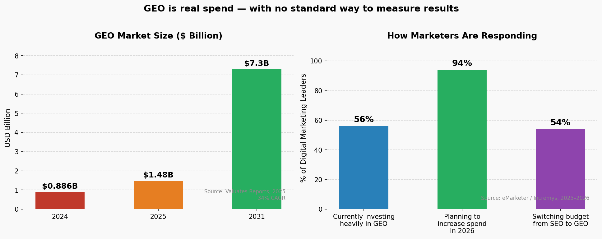
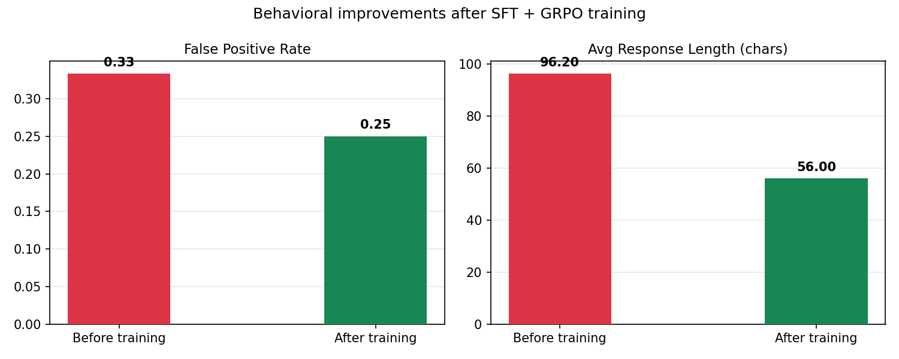
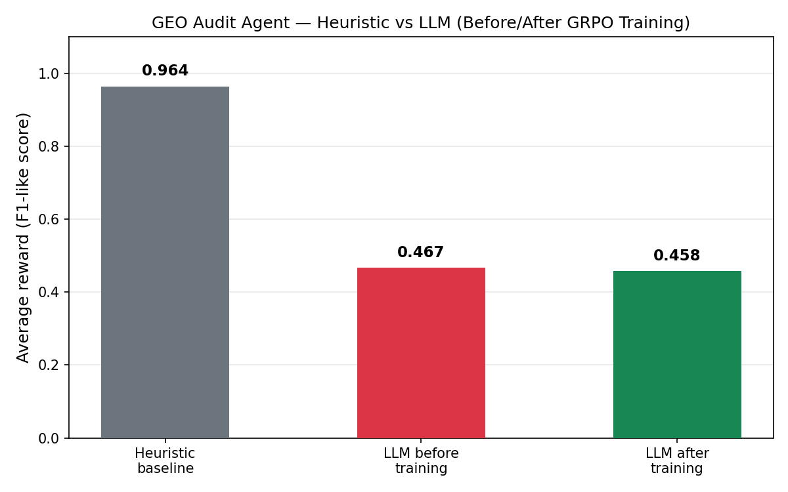

# I turned GEO auditing into an RL environment. Here is what actually happened.

The frustration came first.

I kept watching teams spend real money on GEO work — AI search optimization, answer engine visibility — with no clean way to measure whether any of it was working. The outputs looked confident. The advice sounded smart. But there was no ground truth, no verifier, no number you could point at and say: this agent is better than that one.

Most tools in this space let a human read AI output and decide what to do. That is not evaluation. That is a text box.


*GEO services market growing from $886M (2024) to $7.3B (2031) at 34% CAGR. 94% of digital marketing leaders plan to increase spend in 2026. Sources: Valuates Reports, eMarketer, Incremys.*

So I built the other thing.

## The environment

The GEO Audit Environment gives an agent a webpage and a target query. The agent inspects structured signals — meta description, headers, word count, sources, schema — flags what is wrong, and submits a report. A deterministic verifier scores it against labeled ground truth.

The reward formula:

```
reward = F1(flagged, truth) - (0.1 × false_positive_count)
```

In plain English: the agent gets credit for finding real problems and loses credit for making things up. If it invents issues that are not there, it gets penalized twice — once for being wrong, again with an explicit deduction. Flooding the report with every possible issue type is always a losing move.

A clean page that receives an empty report scores 1.0. Knowing when to say nothing is part of the task.

Before showing this to anyone, I tried to break it myself. Flag nothing. Flag everything. Memorize which issue types appear most often. None of those strategies dominated cleanly. I documented exactly where the reward is soft, because pretending it is unbeatable would be dishonest.

## Before and after — same page, same environment

This is the clearest way to see what training did. Take a page with two real issues: `thin_content` and `missing_meta_description`.

**Before training**, the untrained 7B model outputs:
```json
{"issues":[{"type":"thin_content"},{"type":"no_direct_answer"},{"type":"missing_schema"}]}
```
It found one real issue. It invented two that are not there. Reward: 0.133.

**After training**, the same model outputs:
```json
{"issues":[{"type":"thin_content"}]}
```
One issue. The one that is actually there. Nothing invented. Reward: 0.5.

The model did not get smarter about GEO. It got more honest about what it actually knows.

## What training actually looked like

SFT warm start into GRPO on Qwen2.5-7B-Instruct.

The thing I did not expect: GRPO produces zero signal until SFT teaches the output format first. When SFT loss was at 3.15, every single GRPO reward call returned 0.000 flat. Not low. Zero. The model could not produce a parseable completion, so the reward function had nothing to score.

After 240 SFT steps, loss dropped to 0.841. Then GRPO started producing real variance. Reward standard deviation of 0.172 across completions. The model was actually learning.

After 80 GRPO steps:

- False positive rate: 0.333 to 0.250 (25% fewer hallucinated issues)
- Average response length: 96 characters to 56 characters (42% more concise)
- Reward delta across 4 eval pages: -0.009

That last number looks bad. It is not. On four pages it is noise. What changed is behavior: the model learned to hallucinate less and commit to shorter, more precise outputs. The reward went sideways; the model got measurably better.



## The honest part

The heuristic baseline scores 0.964 on synthetic tasks. The trained model scores 0.458. That gap is real, and I am not going to pretend it is not.



What I care about is that the environment made this outcome visible instead of hiding it. Most GEO tooling cannot tell you whether the model it is running is accurate or just confident. This one can.

On the real benchmark — 49 pages collected from the live web, labeled by hand — the heuristic scores 0.571 and the learned model scores 0.460. The gap narrows. Real pages are harder and noisier, which is exactly what makes them a useful proof set.

## Why this matters

GEO work is guesswork until you can measure it.

The environment is live at [samunhashed-geo-audit-env.hf.space](https://samunhashed-geo-audit-env.hf.space). You can run a full audit episode right now with three curl commands. The code, benchmark data, and training scripts are open.

This is the measuring instrument.
